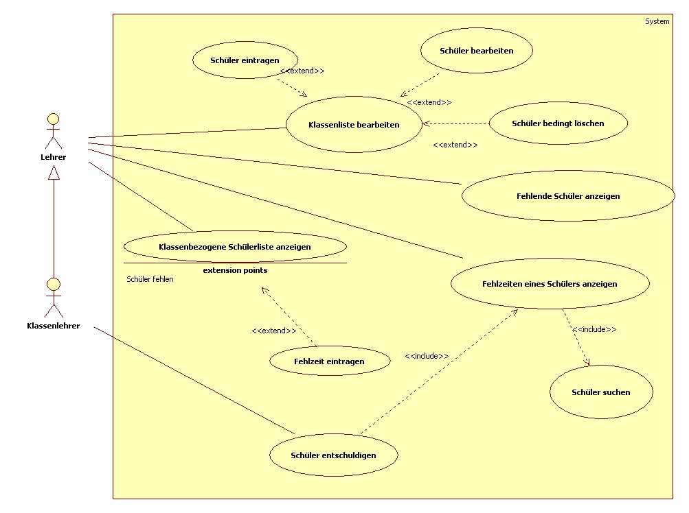

# Projekt Dokumentation Umzug - Projektmanagement

| Gruppenmitglieder  |
|--------------------|
| Sebastian Büttner  |
| Robin Kaiser       |
| Marko Ancev        |

## Teil 1: Planung Netzwerk

### Anforderungsanalyse - Netzwerk

In Ihrem Kleinunternehmen arbeiten alle 5 MitarbeiterInnen bisher in einem Großraumbüro auf einer Etage. Sowohl aus Platz als auch aus Lärmschutzgründen, wurde eine zweite Etage angemietet. Sie sollen nun die hierfür notwendige Neustrukturierung des Netzwerks planen und umsetzen. Bisher waren die Rechner über einen Switch an den vom Internetserviceprovider ISP bereitgestellten Router angebunden. Die Netzwerkkarten der PCs und Drucker waren bisher manuell konfiguriert. In Zukunft ist eine dynamische Vergabe der IP-Adressen gewünscht. Die Etagen sollen in eigenen Netzwerken liegen. Alle Geräte sollen Internetzugang haben.  

### Anforderungen Netzwerk

- 2 Etagen je 200qm
- Laptops für Mitarbeiter - LAN mit Docking Station (per LAN angebunden)
- WLAN für Gäste in Besprechungsräumen direkte Verbindung mit Internet (nicht im Intranetz)
- Budget: 75k €  
- Räumlichkeiten vorhanden (E1, E2, Serverraum)  
- Wir brauchen: (Server, 2 Switches, Router, Docking-Station, Storage Server für Tausch-Laufwerk, Datenbank-Server)
- eventuelles Schulungs-Environment bei Expansion (Zukunftssicher ausbauen)
- Drei Netze (Beschaffung, Verwaltung, Technik) - mehr Netze in Zukunft, Enterprise Router + Switch nötig, Größe des Netzes: öffentliche IP und Maske
- Besorgung von Endgeräten nötig
- Glasfaser möglich für Internetverbindung (muss bestellt werden bei ISP, so planen, dass erst Kupfer und dann zu späterem Zeitpunkt Glasfaser geht (ISP zu Intern))
- VPN wegen home office, Active-Directory für home office und  
- Alle Mitarbeiter (alt und neu) erhalten neue Endgeräte
- IP-Telefonie für jeden Arbeitsplatz (~30, in Zukunft evtl. ~50)
- Ein Drucker pro Etage = gesamt 2 Drucker

Etage 1 – Subnet 1:

- 12 Rechner (für Mitarbeiter)
- 12 Docks (für Arbeitsplätze)
- 1 Drucker
- 3 Access Point Switches verbunden mit jeweils 4 Arbeitplatz Switches
- 3 Meeting Räume -> 3 Wireless Access Points

Etage 2 – Subnet 2:

- 12 Rechner (für Mitarbeiter)
- 12 Docks (für Arbeitsplätze)
- 1 Drucker
- 3 Access Point Switches verbunden mit jeweils 4 Arbeitsplatz Switches
- 3 Meeting Räume -> 3 Wireless Access Points

### Zeitschätzung und Planung der Arbeitspakete

Verwendet wurde [Microsoft Planner](https://tasks.office.com/itSchuleStuttgart1.onmicrosoft.com/en-US/Home/Planner/#/plantaskboard?groupId=4fad89ac-9e0f-4640-84c7-e18e0e8d94fa&planId=LoDvJ76MmEyOiuLs5Am18ZYAD9PE)

### Kostenschätzung

| Produkt | Name | Preis (€) | Menge |
|:---|:---|:---:|:---:|
| Kamera | Aukey PC-LME1E | 12,97 | 30 |
| Monitor | Samsung S31A | 96,38 | 30 |
| Lan Transceiver | TP-Link SM5110 | 19,90 | 20 |
| USB Dock | Dell WD19S | 125,10 | 30 |
| Router | Cisco RV260P | 499,80 | 1 |
| Switch | TP-Link SF1000 | 46,89 | 2 |
| Switch | Intellinet Desktop | 42,12 | 24 |
| Switch | TRENDnet TPE | 70,36 | 2 |
| Switch | Digitus DN-953 | 48,53 | 2 |
| WAP | TP-Link Omada | 633,90 | 13 |
| Cat6 Kabel | Twisted-Pair | 138,60 | 1x500m |
| Schloss | Lenovo Kensington | 24,90 | 20 |
| PC | Lenovo T16 | 1516,00 | 30 |
| IP Telefon | Cisco 7821 IP | 110,16 | 30 |
| Crimp Stecker | Faconet RJ45 | 9,95 | 30 |
|||||
| **Gesamt** || **67905,69** ||

### Netzplan

< Tabellarische Auflistung der geplanten Netze als Vorlage für technische Umsetzung, d.h. Netze mit Subnetmaske, Gerätebezeichnungen für Router und Switche, Tabelle mit Verbindungen zwischen Backbone Geräten, also zum Beispiel   switch A – Port 4 auf Router B – Interface FA/0 >

### Demonstrationsprototyp Packet Tracer

< Aufbau eines exemplarischen, funktionsfähigen Netzwerks >

## Teil 2: Datenbank mit Datenexport

### Anforderungsanalyse - Datenbank

- Uniformer Datenaustausch mit Netzwerkspeicher (kleine Kapazität < 1TB) soll abgeschafft werden -> ersetzt durch Datenbankstruktur  
- Verwaltungssoftware als separate Datenbank (JSON-Datei)
- In der DB:
• Person
• Abteilung
• Rechte, Lese und Schreibrechte für User
• Eintritts -/ Austrittsdaten

- Personalverwaltungssoftware braucht keine Berechtigung oder Authentifizierung,
- Auf DB einen User einrichten welcher root Rechte besitzt – nicht direkt als root auf DB zugreifen.

### Use Case Analyse

< Grafische Darstellung der Anforderungen in Form von Use Cases >

### Use Case Beschreibung

< Detaillierte Beschreibung der Use Cases nach einer vorgegebenen Struktur >

| USE CASE: Schüler entschuldigen ||
| --- | --- |
| **Primärer Aktor** | Klassenlehrer |
| **Vorbedingung** | Fehlzeit vorhanden |
| **Wichtigstes Erfolgsszenario** | 1. Lehrer sucht Schüler   2. Fehlzeiten des Schülers werden angezeigt   3. Fehlzeit wird bearbeitet   4. Fehlzeit wird gespeichert |
| **Wichtige Varianten** | 2.a Fehlzeit befindet sich nicht im System obwohl Entschuldigung vorliegt   3.a Wechsel zu Use Case ‚Fehlzeit eintragen’ |
| **Auswirkungen** | Fehlzeit als ‚Entschuldigt’ markiert |
| **Anmerkungen** | Klassenlehrer kann sowohl Anfang als auch Ende der Fehlzeit bearbeiten |
| **Offene Fragen** | Darf vorhandene Fehlzeit gelöscht werden? |

| USE CASE: Klassenliste bearbeiten ||
|---|---|
| Primärer Aktor | Lehrer |
| Vorbedingung | Klassenliste nicht aktuell |
| Wichtigstes Erfolgsszenario | 1. Lehrer wählt Klasse aus   2. Schülerliste wird angezeigt   3. Lehrer ändert Daten |
| Wichtige Varianten | 2.a keine Schüler vorhanden   3.a Lehrer fügt Schüler hinzu |
| Auswirkungen | Schülerliste wird aktualisiert |
| Anmerkungen | Jeder Lehrer kann Klassenliste jederzeit bearbeiten |
| Offene Fragen | - |

### Abgrenzungskriterien

<Funktionalität die das System nicht besitzt>

### Systemarchitektur

<Beschreibung der verwendeten Infrastrukturkomponenten (Datenbanken, Server, Technologien) und grafische Darstellung der Gesamtarchitektur, z.B C#, MySQL Datenbank;>

### Implementierung

### Statische Perspektive (Klassendiagramme)

< UML-Klassendiagramm der wesentlichen Klassen >

### Test

<Tabellarische Beschreibung der wesentlichen Testfälle und deren Durchführung. Zum Beispiel mit folgenden Spalten.: Testnummer- Testbeschreibung- Erwartetes Ergebnis - Bestanden>
