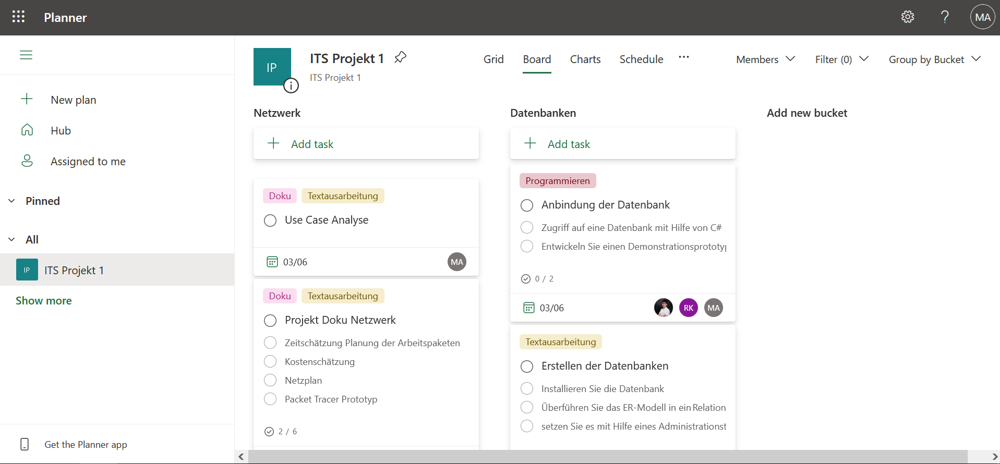
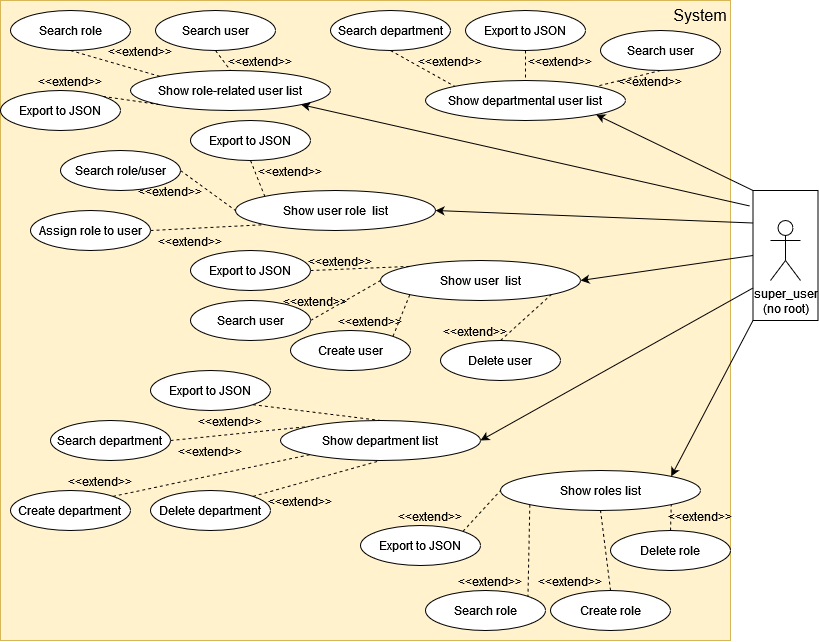
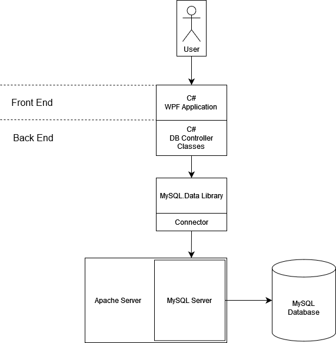
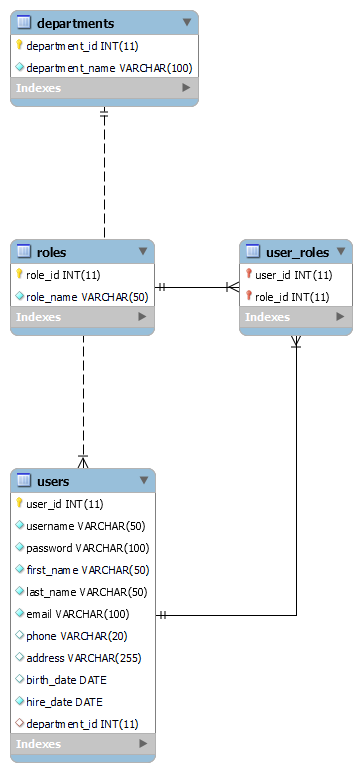

# Projekt Dokumentation Umzug - Projektmanagement

| Gruppenmitglieder  | 
|--------------------|
| Sebastian Büttner  |
| Robin Kaiser       |
| Marko Ancev        |

# Zeitaufwand
- 2-3 Wochen
- Kosten pro Person 400€ pro Tag

## Teil 1: Planung Netzwerk

### Anforderungsanalyse - Netzwerk

In Ihrem Kleinunternehmen arbeiten alle 5 MitarbeiterInnen bisher in einem Großraumbüro auf einer Etage. Sowohl aus Platz als auch aus Lärmschutzgründen, wurde eine zweite Etage angemietet. Sie sollen nun die hierfür notwendige Neustrukturierung des Netzwerks planen und umsetzen. Bisher waren die Rechner über einen Switch an den vom Internetserviceprovider ISP bereitgestellten Router angebunden. Die Netzwerkkarten der PCs und Drucker waren bisher manuell konfiguriert. In Zukunft ist eine dynamische Vergabe der IP-Adressen gewünscht. Die Etagen sollen in eigenen Netzwerken liegen. Alle Geräte sollen Internetzugang haben.  

### Anforderungen Netzwerk

- 2 Etagen je 200qm
- Laptops für Mitarbeiter - LAN mit Docking Station (per LAN angebunden)
- WLAN für Gäste in Besprechungsräumen direkte Verbindung mit Internet (nicht im Intranetz)
- Budget: 75k €  
- Räumlichkeiten vorhanden (E1, E2, Serverraum)  
- Wir brauchen: (Server, 2 Switches, Router, Docking-Station, Storage Server für Tausch-Laufwerk, Datenbank-Server)
- eventuelles Schulungs-Environment bei Expansion (Zukunftssicher ausbauen)
- Drei Netze (Beschaffung, Verwaltung, Technik) - mehr Netze in Zukunft, Enterprise Router + Switch nötig, Größe des Netzes: öffentliche IP und Maske
- Besorgung von Endgeräten nötig
- Glasfaser möglich für Internetverbindung (muss bestellt werden bei ISP, so planen, dass erst Kupfer und dann zu späterem Zeitpunkt Glasfaser geht (ISP zu Intern))
- VPN wegen home office, Active-Directory für home office und  
- Alle Mitarbeiter (alt und neu) erhalten neue Endgeräte
- IP-Telefonie für jeden Arbeitsplatz (~30, in Zukunft evtl. ~50)
- Ein Drucker pro Etage = gesamt 2 Drucker

Etage 1 – Subnet 1:

- 12 Rechner (für Mitarbeiter)
- 12 Docks (für Arbeitsplätze)
- 1 Drucker
- 3 Access Point Switches verbunden mit jeweils 4 Arbeitplatz Switches
- 3 Meeting Räume -> 3 Wireless Access Points

Etage 2 – Subnet 2:

- 12 Rechner (für Mitarbeiter)
- 12 Docks (für Arbeitsplätze)
- 1 Drucker
- 3 Access Point Switches verbunden mit jeweils 4 Arbeitsplatz Switches
- 3 Meeting Räume -> 3 Wireless Access Points

### Zeitschätzung und Planung der Arbeitspakete

Verwendet wurde [Microsoft Planner](https://tasks.office.com/itSchuleStuttgart1.onmicrosoft.com/en-US/Home/Planner/#/plantaskboard?groupId=4fad89ac-9e0f-4640-84c7-e18e0e8d94fa&planId=LoDvJ76MmEyOiuLs5Am18ZYAD9PE)



### Kostenschätzung

| Produkt | Name | Preis (€) | Menge |
|:---|:---|:---:|:---:|
| Kamera | Aukey PC-LME1E | 12,97 | 30 |
| Monitor | Samsung S31A | 96,38 | 30 |
| Lan Transceiver | TP-Link SM5110 | 19,90 | 20 |
| USB Dock | Dell WD19S | 125,10 | 30 |
| Router | Cisco RV260P | 499,80 | 1 |
| Switch | TP-Link SF1000 | 46,89 | 2 |
| Switch | Intellinet Desktop | 42,12 | 24 |
| Switch | TRENDnet TPE | 70,36 | 2 |
| Switch | Digitus DN-953 | 48,53 | 2 |
| WAP | TP-Link Omada | 633,90 | 13 |
| Cat6 Kabel | Twisted-Pair | 138,60 | 1x500m |
| Schloss | Lenovo Kensington | 24,90 | 20 |
| PC | Lenovo T16 | 1516,00 | 30 |
| IP Telefon | Cisco 7821 IP | 110,16 | 30 |
| Crimp Stecker | Faconet RJ45 | 9,95 | 30 |
|||||
| **Gesamt** || **67905,69** ||

### Netzplan

Legende:
- Nummern wie folgt interpretieren:
  - **2**.x.x    = Stockwerk **2** = S2
  - 2.x.x(**1**) = Stockwerk **1** = S1
- **Größe** und **t. Größe**:
  - Größe       = genutzte Größe durch Switch-Limitierung (Portanzahl)
  - theo. Größe = theoretische Größe des netztes **ohne Inbetrachtnahme** von **Switch-Limitierungen** oder **Maske**!
- Erste / Letzte IP:
  - Erste / Letzte IP beginnt **nach** der **fett geschriebenen Ziffer** der IP-Range!7
  - Bsp:
    - IP-Range:           192.**1**.0.0 - 192.**1**.0.7
    - Erste/Letzte IP:    .0.1 / .0.6
    - ausgeschrieben:     192.**1**.0.1 - 192.**1**.0.6

---

| Name       | Gerätname       | Netznummer | Genutzt | Größe | Maske | IP-Range                        | Erste IP | Letzte IP |
|--          |--               |--          |--       |--     |--     |--                               |--        |--         |
| Stockwerk1 | Switch 2.0.0(1) | 2.0.0(1)   | 5       | 8     | /29   | 192.**1**.0.0 - 192.**1**.4.255 | .0.1     | .4.254    |
| S1 Row 1   | Switch 2.1.1(1) | 2.1.0(1)   | 24      | 32    | /27   | 192.1.**1**.0 - 192.1.**1**.31  | .1       | .30       |
| S1 Row 2   | Switch 2.2.1(1) | 2.2.0(1)   | 24      | 32    | /27   | 192.1.**2**.0 - 192.1.**2**.31  | .1       | .30       |
| S1 Row 3   | Switch 2.3.0(1) | 2.3.0(1)   | 4       | 8     | /29   | 192.1.**3**.0 - 192.1.**3**.7   | .1       | .6        |
| S1 Wlan    | Switch 2.4.0(1) | 2.4.0(1)   | 7       | 16    | /28   | 192.1.**4**.0 - 192.1.**4**.15  | .1       | .14       |
|            |                 |            |         |       |       |                                 |          |           |
| Stockwerk2 | Switch 2.0.0    | 2.0.0      | 6       | 8     | /29   | 192.**2**.0.0 - 192.**2**.5.255 | .0.1     | .5.254    |
| S2 Row 1   | Switch 2.1.1    | 2.1.0      | 24      | 32    | /27   | 192.2.**1**.0 - 192.2.**1**.31  | .1       | .30       |
| S2 Row 2   | Switch 2.2.1    | 2.2.0      | 24      | 32    | /27   | 192.2.**2**.0 - 192.2.**2**.31  | .1       | .30       |
| S2 Row 3   | Switch 2.3.0    | 2.3.0      | 4       | 8     | /29   | 192.2.**3**.0 - 192.2.**3**.7   | .1       | .6        |
| S2 Wlan    | Switch 2.4.0    | 2.4.0      | 10      | 16    | /28   | 192.2.**4**.0 - 192.2.**4**.15  | .1       | .14       |
| S2 Meeting | Switch 2.5.0    | 2.5.0      | 20      | 32    | /27   | 192.2.**5**.0 - 192.2.**5**.15  | .1       | .14       |
|            |                 |            |         |       |       |                                 |          |           |
| Sevrerraum | Switch 3        | 3          | 5       | 8     | /29   | 192.**3**.0.0 - 192.**3**.0.7   | .0.1     | .0.6      |
|            |                 |            |         |       |       |                                 |          |           |
| Router     | Router          | -          | 4       | 8     | /29   | **192**.0.0.0 - **192**.0.0.7   | .0.0.1   | .0.0.6    |
|            |                 |            |         |       |       |                                 |          |           |

---

### Demonstrationsprototyp Packet Tracer

Der Prototyp wurde in [Cisco Packet Tracer](https://www.netacad.com/courses/packet-tracer) erstellt.

Link zum [Prototyp](../pt_files/Schulprojekt%201%20v0.6.pkt).

## Teil 2: Datenbank mit Datenexport

### Anforderungsanalyse - Datenbank

- Uniformer Datenaustausch mit Netzwerkspeicher (kleine Kapazität < 1TB) soll abgeschafft werden -> ersetzt durch Datenbankstruktur  
- Verwaltungssoftware als separate Datenbank (JSON-Datei)
- In der DB:
• Person
• Abteilung
• Rechte, Lese und Schreibrechte für User
• Eintritts -/ Austrittsdaten

- Personalverwaltungssoftware braucht keine Berechtigung oder Authentifizierung,
- Auf DB einen User einrichten welcher root Rechte besitzt – nicht direkt als root auf DB zugreifen.

### Use Case Analyse



### Use Case Beschreibung

| USE CASE: Nutzerliste anzeigen ||
| --- | --- |
| **Primärer Aktor** | Super User |
| **Vorbedingung** | Nutzerinformationen sind unbekannt |
| **Wichtigstes Erfolgsszenario** | 1. Administrator sucht Nutzer <br> 2. Nutzerinformationen werden angezeigt |
| **Wichtige Varianten** | 1.a Administrator kennt nur manche Nutzerinformationen <br> 1.b Wechsel zu Use Case ‚Nutzer suchen’ |
| **Auswirkungen** | Nutzerinformationen sind sichtbar |
| **Anmerkungen** | Alle Nutzerinformationen sind für den Super User sichtbar |
| **Offene Fragen** | Sollen für den Super User nicht relevante Informationen verborgen werden? |

| USE CASE: Rollenliste anzeigen ||
| --- | --- |
| **Primärer Aktor** | Super User |
| **Vorbedingung** | Rolleninformationen sind unbekannt |
| **Wichtigstes Erfolgsszenario** | 1. Administrator sucht Rolle <br> 2. Rolleninformationen werden angezeigt |
| **Wichtige Varianten** | 1.a Administrator kennt nur manche Rolleninformationen <br> 1.b Wechsel zu Use Case ‚Rolle suchen’ |
| **Auswirkungen** | Rolleninformationen sind sichtbar |
| **Anmerkungen** | Alle Rolleninformationen sind für den Super User sichtbar |
| **Offene Fragen** | Sollen für den Super User nicht relevante Informationen verborgen werden? |

| USE CASE: Abteilungsliste anzeigen ||
| --- | --- |
| **Primärer Aktor** | Super User |
| **Vorbedingung** | Abteilungsinformationen sind unbekannt |
| **Wichtigstes Erfolgsszenario** | 1. Administrator sucht Abteilung <br> 2. Abteilungsinformationen werden angezeigt |
| **Wichtige Varianten** | 1.a Administrator kennt nur manche Abteilungsinformationen <br> 1.b Wechsel zu Use Case ‚Abteilung suchen’ |
| **Auswirkungen** | Abteilungsinformationen sind sichtbar |
| **Anmerkungen** | Alle Abteilungsinformationen sind für den Super User sichtbar |
| **Offene Fragen** | Sollen für den Super User nicht relevante Informationen verborgen werden? |

| USE CASE: Nutzerrollen anzeigen ||
| --- | --- |
| **Primärer Aktor** | Super User |
| **Vorbedingung** | Nutzerrolleninformationen sind unbekannt |
| **Wichtigstes Erfolgsszenario** | 1. Administrator sucht Nutzerrolle <br> 2. Nutzerrolleninformationen werden angezeigt |
| **Wichtige Varianten** | 1.a Administrator kennt nur manche Nutzerrolleninformationen <br> 1.b Wechsel zu Use Case ‚Nutzerrolle suchen’ |
| **Auswirkungen** | Nutzerrolleninformationen sind sichtbar |
| **Anmerkungen** | Alle Nutzerrolleninformationen sind für den Super User sichtbar |
| **Offene Fragen** | Sollen für den Super User nicht relevante Informationen verborgen werden? |

| USE CASE: Rollenabhängige Nutzerliste anzeigen ||
| --- | --- |
| **Primärer Aktor** | Super User |
| **Vorbedingung** | Rollenabhängige Nutzerinformationen sind unbekannt |
| **Wichtigstes Erfolgsszenario** | 1. Administrator sucht rollenabhängige Nutzerliste <br> 2. Rollenabhängige Nutzerinformationen werden angezeigt |
| **Wichtige Varianten** | 1.a Administrator kennt nur manche rollenabhängige Nutzerinformationen <br> 1.b Wechsel zu Use Case ‚Rollenabhängige Nutzerliste suchen’ |
| **Auswirkungen** | Rollenabhängige Nutzerinformationen sind sichtbar |
| **Anmerkungen** | Alle rollenabhängigen Nutzerinformationen sind für den Super User sichtbar |
| **Offene Fragen** | Sollen für den Super User nicht relevante Informationen verborgen werden? |

| USE CASE: Nutzer suchen ||
|---|---|
| **Primärer Aktor** | Super User |
| **Vorbedingung** | Nutzerinformationen sind bekannt |
| **Wichtigstes Erfolgsszenario** | 1. Super User sucht nach Nutzer anhand von Nutzername, Vorname, Nachname, etc. nach Nutzereintrag <br> 2. Nutzerliste wird angezeigt |
| **Wichtige Varianten** | 2.a Wechsel zu Use Case ‚Liste exportieren’ <br> 2.b Super User sucht nach dem nächsten Nutzer, wechsel zu Use Case ,Nutzer suchen’ |
| **Auswirkungen** | Angezeigte Nutzerliste zeigt anhand von Suchkriterien gefundene Nutzer an |
| **Anmerkungen** | - |
| **Offene Fragen** | - |

| USE CASE: Rolle suchen ||
| --- | --- |
| **Primärer Aktor** | Super User |
| **Vorbedingung** | Rolleninformationen sind bekannt |
| **Wichtigstes Erfolgsszenario** | 1. Super User sucht nach Rolle anhand von Rollenname, Beschreibung, etc. <br> 2. Rollenliste wird angezeigt |
| **Wichtige Varianten** | 2.a Wechsel zu Use Case ‚Liste exportieren’ <br> 2.b Super User sucht nach der nächsten Rolle, wechsel zu Use Case ‚Rolle suchen’ |
| **Auswirkungen** | Angezeigte Rollenliste zeigt anhand von Suchkriterien gefundene Rollen an |
| **Anmerkungen** | - |
| **Offene Fragen** | - |

| USE CASE: Abteilung suchen ||
| --- | --- |
| **Primärer Aktor** | Super User |
| **Vorbedingung** | Abteilungsinformationen sind bekannt |
| **Wichtigstes Erfolgsszenario** | 1. Super User sucht nach Abteilung anhand von Abteilungsname, Beschreibung, etc. <br> 2. Abteilungsliste wird angezeigt |
| **Wichtige Varianten** | 2.a Wechsel zu Use Case ‚Liste exportieren’ <br> 2.b Super User sucht nach der nächsten Abteilung, wechsel zu Use Case ‚Abteilung suchen’ |
| **Auswirkungen** | Angezeigte Abteilungsliste zeigt anhand von Suchkriterien gefundene Abteilungen an |
| **Anmerkungen** | - |
| **Offene Fragen** | - |

| USE CASE: Nutzerrolle suchen ||
| --- | --- |
| **Primärer Aktor** | Super User |
| **Vorbedingung** | Nutzerrolleninformationen sind bekannt |
| **Wichtigstes Erfolgsszenario** | 1. Super User sucht nach Nutzerrolle anhand von Rollenname, Beschreibung, etc. <br> 2. Nutzerrollenliste wird angezeigt |
| **Wichtige Varianten** | 2.a Wechsel zu Use Case ‚Liste exportieren’ <br> 2.b Super User sucht nach der nächsten Nutzerrolle, wechsel zu Use Case ‚Nutzerrolle suchen’ |
| **Auswirkungen** | Angezeigte Nutzerrollenliste zeigt anhand von Suchkriterien gefundene Nutzerrollen an |
| **Anmerkungen** | - |
| **Offene Fragen** | - |

| USE CASE: Rollenabhängige Nutzerliste suchen ||
| --- | --- |
| **Primärer Aktor** | Super User |
| **Vorbedingung** | Rollenabhängige Nutzerinformationen sind bekannt |
| **Wichtigstes Erfolgsszenario** | 1. Super User sucht nach rollenabhängiger Nutzerliste anhand von Rollenname, Beschreibung, etc. <br> 2. Rollenabhängige Nutzerliste wird angezeigt |
| **Wichtige Varianten** | 2.a Wechsel zu Use Case ‚Liste exportieren’ <br> 2.b Super User sucht nach der nächsten rollenabhängigen Nutzerliste, wechsel zu Use Case ‚Rollenabhängige Nutzerliste suchen’ |
| **Auswirkungen** | Angezeigte rollenabhängige Nutzerliste zeigt anhand von Suchkriterien gefundene rollenabhängige Nutzer an |
| **Anmerkungen** | - |
| **Offene Fragen** | - |

| USE CASE: Abteilungsabhängige Nutzerliste suchen ||
| --- | --- |
| **Primärer Aktor** | Super User |
| **Vorbedingung** | Abteilungsabhängige Nutzerinformationen sind bekannt |
| **Wichtigstes Erfolgsszenario** | 1. Super User sucht nach abteilungsabhängiger Nutzerliste anhand von Abteilungsname, Beschreibung, etc. <br> 2. Abteilungsabhängige Nutzerliste wird angezeigt |
| **Wichtige Varianten** | 2.a Wechsel zu Use Case ‚Liste exportieren’ <br> 2.b Super User sucht nach der nächsten abteilungsabhängigen Nutzerliste, wechsel zu Use Case ‚Abteilungsabhängige Nutzerliste suchen’ |
| **Auswirkungen** | Angezeigte abteilungsabhängige Nutzerliste zeigt anhand von Suchkriterien gefundene abteilungsabhängige Nutzer an |
| **Anmerkungen** | - |
| **Offene Fragen** | - |

| USE CASE: Liste Exportieren ||
|---|---|
| **Primärer Aktor** | Super User |
| **Vorbedingung** | - |
| **Wichtigstes Erfolgsszenario** | 1. Super User exportiert Liste der aktuellen Tabelle <br> 2. Exportierte Liste wird als Datei auf dem Rechner abgespeichert unter "C:/DATA/" |
| **Wichtige Varianten** | - |
| **Auswirkungen** | Exportierte Tabelle befindet sich auf "C:/DATA/" im JSON Format mit relevanter Benennung |
| **Anmerkungen** | Bei erneutem Exportieren wird die alte Datei überschrieben |
| **Offene Fragen** | Sollten erneut Exportierte Dateien mit Suffixen versehen werden, oder alte Dateien in ein Backupverzeichnis verschoben werden, um Datenverlust zu verhindern? |

| USE CASE: Nutzer erstellen ||
| --- | --- |
| **Primärer Aktor** | Super User |
| **Vorbedingung** | - |
| **Wichtigstes Erfolgsszenario** | 1. Super User erstellt neuen Nutzer mit relevanten Informationen wie Nutzername, Vorname, Nachname, usw. <br> 2. Bestätigung der erfolgreichen Erstellung wird angezeigt |
| **Wichtige Varianten** | - |
| **Auswirkungen** | Neuer Nutzer wird im System angelegt |
| **Anmerkungen** | - |
| **Offene Fragen** | - |

| USE CASE: Abteilung erstellen ||
| --- | --- |
| **Primärer Aktor** | Super User |
| **Vorbedingung** | - |
| **Wichtigstes Erfolgsszenario** | 1. Super User erstellt neue Abteilung mit relevanten Informationen wie Abteilungsname, Beschreibung, usw. <br> 2. Bestätigung der erfolgreichen Erstellung wird angezeigt |
| **Wichtige Varianten** | - |
| **Auswirkungen** | Neue Abteilung wird im System angelegt |
| **Anmerkungen** | - |
| **Offene Fragen** | - |

| USE CASE: Rolle erstellen ||
| --- | --- |
| **Primärer Aktor** | Super User |
| **Vorbedingung** | - |
| **Wichtigstes Erfolgsszenario** | 1. Super User erstellt neue Rolle mit relevanten Informationen wie Rollenname, Beschreibung, usw. <br> 2. Bestätigung der erfolgreichen Erstellung wird angezeigt |
| **Wichtige Varianten** | - |
| **Auswirkungen** | Neue Rolle wird im System angelegt |
| **Anmerkungen** | - |
| **Offene Fragen** | - |

| USE CASE: Nutzerdaten aktualisieren ||
| --- | --- |
| **Primärer Aktor** | Super User |
| **Vorbedingung** | Nutzer existiert im System |
| **Wichtigstes Erfolgsszenario** | 1. Super User wählt einen bestehenden Nutzer aus <br> 2. Super User aktualisiert die relevanten Informationen des Nutzers wie Nutzername, Vorname, Nachname, usw. <br> 3. Bestätigung der erfolgreichen Aktualisierung wird angezeigt |
| **Wichtige Varianten** | - |
| **Auswirkungen** | Nutzerinformationen werden im System aktualisiert |
| **Anmerkungen** | - |
| **Offene Fragen** | - |

| USE CASE: Nutzerrolle aktualisieren ||
| --- | --- |
| **Primärer Aktor** | Super User |
| **Vorbedingung** | Nutzer und Rollen existieren im System |
| **Wichtigstes Erfolgsszenario** | 1. Super User wählt einen bestehenden Nutzer aus <br> 2. Super User wählt eine neue oder bestehende Rolle aus <br> 3. Super User aktualisiert die Rolle des Nutzers <br> 4. Bestätigung der erfolgreichen Aktualisierung wird angezeigt |
| **Wichtige Varianten** | - |
| **Auswirkungen** | Nutzerrolle wird im System aktualisiert |
| **Anmerkungen** | - |
| **Offene Fragen** | - |

| USE CASE: Nutzer löschen ||
| --- | --- |
| **Primärer Aktor** | Super User |
| **Vorbedingung** | Nutzer existiert im System |
| **Wichtigstes Erfolgsszenario** | 1. Super User wählt einen bestehenden Nutzer aus <br> 2. Super User bestätigt das Löschen des Nutzers <br> 3. Bestätigung der erfolgreichen Löschung wird angezeigt |
| **Wichtige Varianten** | - |
| **Auswirkungen** | Nutzer wird aus dem System entfernt |
| **Anmerkungen** | - |
| **Offene Fragen** | - |

| USE CASE: Abteilung löschen ||
| --- | --- |
| **Primärer Aktor** | Super User |
| **Vorbedingung** | Abteilung existiert im System |
| **Wichtigstes Erfolgsszenario** | 1. Super User wählt eine bestehende Abteilung aus <br> 2. Super User bestätigt das Löschen der Abteilung <br> 3. Bestätigung der erfolgreichen Löschung wird angezeigt |
| **Wichtige Varianten** | - |
| **Auswirkungen** | Abteilung wird aus dem System entfernt |
| **Anmerkungen** | - |
| **Offene Fragen** | - |

| USE CASE: Rolle löschen ||
| --- | --- |
| **Primärer Aktor** | Super User |
| **Vorbedingung** | Rolle existiert im System |
| **Wichtigstes Erfolgsszenario** | 1. Super User wählt eine bestehende Rolle aus <br> 2. Super User bestätigt das Löschen der Rolle <br> 3. Bestätigung der erfolgreichen Löschung wird angezeigt |
| **Wichtige Varianten** | - |
| **Auswirkungen** | Rolle wird aus dem System entfernt |
| **Anmerkungen** | - |
| **Offene Fragen** | - |

### Abgrenzungskriterien

**Keine Integration von externen Diensten**: Das System integriert sich nicht automatisch mit externen Diensten oder Systemen wie CRM-Systemen, E-Mail-Diensten oder Kalendersystemen.

**Kein Benachrichtigungssystem**: Das System bietet keine integrierten Benachrichtigungsfunktionen für Benutzer, wie z. B. E-Mail-Benachrichtigungen oder Push-Benachrichtigungen.

**Keine Versionierung von Daten**: Das System verfügt nicht über Funktionen zur Versionierung von Daten. Es werden keine historischen Versionen von Datensätzen gespeichert oder verwaltet.

**Keine Mehrsprachigkeit**: Das System unterstützt keine mehrsprachigen Benutzeroberflächen oder die Übersetzung von Inhalten in verschiedene Sprachen.

**Kein Rollenbasiertes Zugriffsmanagement**: Das System bietet keine granulare rollenbasierte Zugriffskontrolle auf bestimmte Funktionen oder Datenbereiche. Super User hat Zugriff auf alle Funktionen, ist dennoch kein `root` User.

### Systemarchitektur



Datenbank: [MySQL](https://www.mysql.com/)

Programmiersprache: [C#](https://docs.microsoft.com/en-us/dotnet/csharp/)

IDE: [Visual Studio](https://visualstudio.microsoft.com/)

Datenbankverwaltung: [MySQL Workbench](https://www.mysql.com/products/workbench/)

Versionsverwaltung: [Git](https://git-scm.com/)

Dokumentation: [Markdown](https://www.markdownguide.org/)

Vorkonfigurierte Datenbank mit `super_user` Rolle in den Einstellungen: [user_management.sql](../db_files/user_management.sql)

### Datenbankstruktur



### Implementierung

#### Klassenstruktur

```csharp
UserDAO

- ConnectionString: string

Methods

+ GetAllUsers(export: bool): List<JObject>
+ GetAnyEntryFromUsers(searchQuery: String, export: bool): List<JObject>
+ GetAllUsersAndDepartmentName(export: bool): List<JObject>
+ GetAnyEntryFromUsersAndDepartmentName(searchQuery: String, export: bool): List<JObject>
+ GetAllUsersAndRoleName(export: bool): List<JObject>
+ GetAnyEntryFromUsersAndRoleName(searchQuery: String, export: bool): List<JObject>
+ AddUser(user: User): int
+ UpdateUser(user: User): int
+ DeleteUser(user: User): int
```

```csharp
User

- UserID: int
- UserName: string
- Password: string
- FirstName: string
- LastName: string
- Email: string
- Phone: string
- Address: string
- BirthDate: DateTime
- HireDate: DateTime
- DepartmentID: int
```

```csharp
RoleDAO

- ConnectionString: string

Methods

+ GetAllRoles(): List<JObject>
+ GetAnyEntryFromRoles(roleID: int): Role
+ AddRole(role: Role): int
+ DeleteRole(roleID: int): int
```

```csharp
Role

- RoleID: int
- RoleName: string
```

```csharp
DepartmentDAO

- ConnectionString: string

Methods

+ GetAllDepartments(): List<JObject>

+ GetAnyEntryFromDepartments(departmentID: int): Department

+ AddDepartment(department: Department): int

+ DeleteDepartment(departmentID: int): int
```

```csharp
Department

- DepartmentID: int

- DepartmentName: string
```

```csharp
UserRoleDAO

- ConnectionString: string

Methods

+ GetAllUserRoles(): List<JObject>

+ GetAnyEntryFromUserRoles(userID: int): UserRole

+ UpdateUserRole(userRole: UserRole): int
```

```csharp
UserRole

- RoleID: int

- UserID: int
```

```csharp
DatabaseConnection

Methods

+ BuildConnectionString(): string
```

### Test

| Testnummer | Testbeschreibung                                                                                                   | Erwartetes Ergebnis                                                                                  | Bestanden |
|------------|--------------------------------------------------------------------------------------------------------------------|-----------------------------------------------------------------------------------------------------|-----------|
| 1          | Abteilung anlegen: Es werden alle Felder (bis auf die DepartmentID) ausgefüllt und der Button “Create” geklickt. | Abteilung wird erfolgreich angelegt und ist auch in der Datenbank zu sehen.                              | ✅        |
| 2          | Abteilung suchen: Es wird ein Text, der in den Informationen des Eintrages vorhanden ist, in die Suchleiste eingegeben. Anschließend wird der Button “Search” geklickt.            | Alle Felder werden automatisch mit den Informationen der Abteilung gefüllt.                              | ✅        |
| 3          | Abteilung löschen: Es wird nur das DepartmentID-Feld mit einer existierenden DepartmentID gefüllt. Anschließend wird der Button “Delete” geklickt.           | Der Eintrag der Abteilung und damit verbundene Informationen werden gelöscht. Wenn es die einzige Abteilung an genau dieser Adresse war, wird auch die Adresse aus der Datenbank gelöscht. | ✅        |
| 4          | Abteilungsliste anzeigen: Es wird der Button “Departments” oder “Search” ohne Eingabe geklickt.                              | Das aktuelle Fenster füllt sich mit Einträgen welches alle Abteilungen als Liste anzeigt. | ✅        |
| 5          | Abteilung exportieren: Es wird die für die aktuelle Kategorie “Export” geklickt.                                 | Eine neue JSON-Datei wird im Testordner erstellt. In dieser Datei sind die Einträge erhalten. | ✅        |
| 6          | Rolle anlegen: Es werden alle Felder (bis auf die RoleID) ausgefüllt und der Button “Create” geklickt. | Rolle wird erfolgreich angelegt und ist auch in der Datenbank zu sehen.                              | ✅        |
| 7          | Rolle suchen: Es wird ein Text, der in den Informationen des Eintrages vorhanden ist, in die Suchleiste eingegeben. Anschließend wird der Button “Search” geklickt.            | Alle Felder werden automatisch mit den Informationen der Rolle gefüllt.                              | ✅        |
| 8          | Rolle löschen: Es wird nur das RoleID-Feld mit einer existierenden RoleID gefüllt. Anschließend wird der Button “Delete” geklickt.           | Der Eintrag der Rolle und damit verbundene Informationen werden gelöscht. Wenn es die einzige Rolle an genau dieser Adresse war, wird auch die Adresse aus der Datenbank gelöscht. | ✅        |
| 9          | Rollenliste anzeigen: Es wird der Button “Roles” oder “Search” ohne Eingabe geklickt.                              | Das aktuelle Fenster füllt sich mit Einträgen welches alle Rollen als Liste anzeigt. | ✅        |
| 10         | Rolle exportieren: Es wird die für die aktuelle Kategorie “Export” geklickt.                                 | Eine neue JSON-Datei wird im Testordner erstellt. In dieser Datei sind die Einträge erhalten. | ✅        |
| 11         | Nutzerrolle suchen: Es wird ein Text, der in den Informationen des Eintrages vorhanden ist, in die Suchleiste eingegeben. Anschließend wird der Button “Search” geklickt.            | Alle Felder werden automatisch mit den Informationen der Nutzerrolle gefüllt.                              | ✅        |
| 12         | Nutzerrolle aktualisieren: Es wird nur das RoleID-Feld mit einer existierenden RoleID gefüllt. Anschließend wird der Button “Update” geklickt.           | Der Eintrag der Nutzerrolle und damit verbundene Informationen werden aktualisiert. | ✅        |
| 13         | Nutzerrollenliste anzeigen: Es wird der Button “UserRoles” oder “Search” ohne Eingabe geklickt.                              | Das aktuelle Fenster füllt sich mit Einträgen welches alle Nutzerrollen als Liste anzeigt. | ✅        |
| 14         | Nutzerrolle exportieren: Es wird die für die aktuelle Kategorie “Export” geklickt.                                 | Eine neue JSON-Datei wird im Testordner erstellt. In dieser Datei sind die Einträge erhalten. | ✅        |
| 15         | Nutzerdaten aktualisieren: Es werden alle Felder (bis auf die UserID) ausgefüllt und der Button “Update” geklickt. | Nutzerdaten werden erfolgreich aktualisiert und sind auch in der Datenbank zu sehen.                              | ✅        |
| 16         | Nutzer löschen: Es wird nur das UserID-Feld mit einer existierenden UserID gefüllt. Anschließend wird der Button “Delete” geklickt.           | Der Eintrag des Nutzers und damit verbundene Informationen werden gelöscht. Wenn es der einzige Nutzer an genau dieser Adresse war, wird auch die Adresse aus der Datenbank gelöscht. | ✅        |
| 17         | Nutzerliste anzeigen: Es wird der Button “Users” oder “Search” ohne Eingabe geklickt.                              | Das aktuelle Fenster füllt sich mit Einträgen welches alle Nutzer als Liste anzeigt. | ✅        |
| 18         | Nutzer exportieren: Es wird die für die aktuelle Kategorie “Export” geklickt.                                 | Eine neue JSON-Datei wird im Testordner erstellt. In dieser Datei sind die Einträge erhalten. | ✅        |
| 19         | Rollenabhängige Nutzerliste suchen: Es wird ein Text, der in den Informationen des Eintrages vorhanden ist, in die Suchleiste eingegeben. Anschließend wird der Button “Search” geklickt.            | Alle Felder werden automatisch mit den Informationen der rollenabhängigen Nutzerliste gefüllt.                              | ✅        |
| 20         | Rollenabhängige Nutzerliste anzeigen: Es wird der Button “RoleBasedUsers” oder “Search” ohne Eingabe geklickt.                              | Das aktuelle Fenster füllt sich mit Einträgen welches alle rollenabhängigen Nutzerlisten als Liste anzeigt. | ✅        |
| 21         | Rollenabhängige Nutzerliste exportieren: Es wird die für die aktuelle Kategorie “Export” geklickt.                                 | Eine neue JSON-Datei wird im Testordner erstellt. In dieser Datei sind die Einträge erhalten. | ✅        |
| 22         | Abteilungsabhängige Nutzerliste suchen: Es wird ein Text, der in den Informationen des Eintrages vorhanden ist, in die Suchleiste eingegeben. Anschließend wird der Button “Search” geklickt.            | Alle Felder werden automatisch mit den Informationen der abteilungsabhängigen Nutzerliste gefüllt.                              | ✅        |
| 23         | Abteilungsabhängige Nutzerliste anzeigen: Es wird der Button “DepartmentBasedUsers” oder “Search” ohne Eingabe geklickt.                              | Das aktuelle Fenster füllt sich mit Einträgen welches alle abteilungsabhängigen Nutzerlisten als Liste anzeigt. | ✅        |
| 24         | Abteilungsabhängige Nutzerliste exportieren: Es wird die für die aktuelle Kategorie “Export” geklickt.                                 | Eine neue JSON-Datei wird im Testordner erstellt. In dieser Datei sind die Einträge erhalten. | ✅        |

